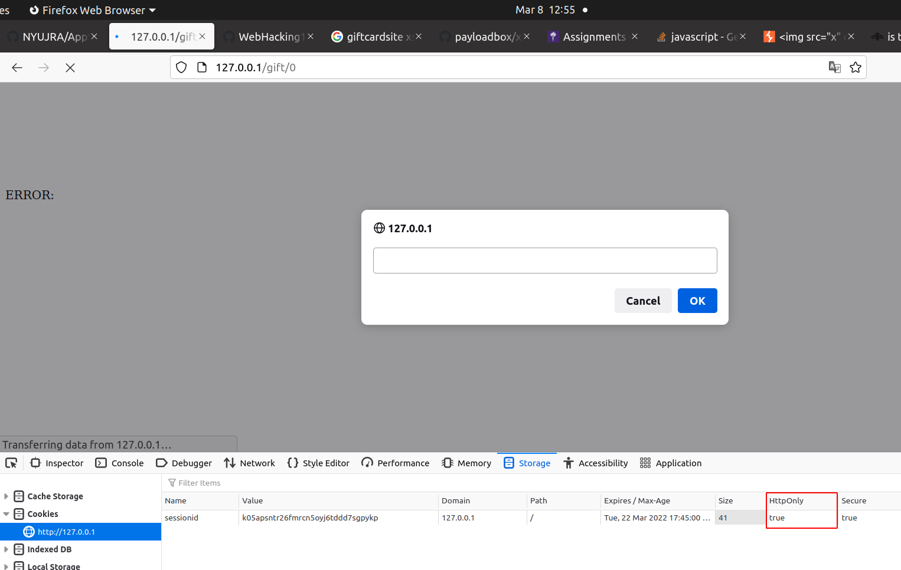

# Part 1: Auditing and Test Cases

## Task 1: Cross-Site Scripting (XSS)
---
### Task 1.a:

 
In order to find the presence of the vulnerabiliy we have to look for input fields or URLs that accept parameters. We then try to inject XSS payloads in every field in order to check for the presence of the vulnerability.

In our case the <b>username</b> field on the gift page was vulnerable. On using payload `svg/onload=prompt(document.cookie)` we get the below result thus conforming that the vulnerability exists.

Here, we cannot see the cookie because the HttpOnly field is set to true. HttpOnly is a flag used in the Set-Cookie response header to prevent a client side script from accessing the sensetive cookie.

If we edit the field manually inside the browser and set it to false we will be able to see the cookie.

### Task 1.b:
---

